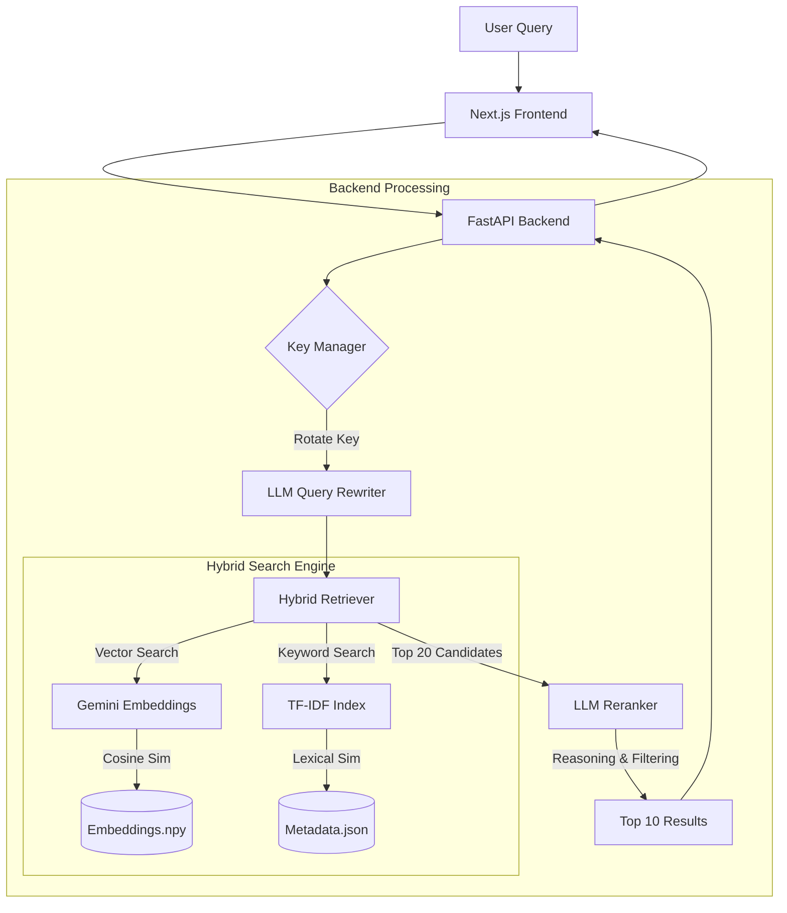

# System Architecture: SHL Assessment Recommender

## 1. High-Level Design

The system is a **Retrieval-Augmented Generation (RAG)** pipeline specialized for recommendation. It does not generate text answers but rather *ranks and selects* structured items (assessments) using LLM reasoning.



---

## 2. Core Components

### A. Key Manager (`app/key_manager.py`)

* **Purpose**: Overcome Google Gemini Free Tier rate limits (5 RPM).
* **Mechanism**: Singleton class managing a pool of API keys (`GEMINI_API_KEY_1`...`3`).
* **Strategy**: **Proactive Rotation**. The key index increments after *every* successful call.
* **Latency Control**: Implements `sleep()` intervals (1s-2s) to prevent 429 bursts.

### B. Query Rewriter (`llm/query_rewriter.py`)

* **Model**: `gemini-2.5-flash`
* **Goal**: Transform vague user intent into specific search terms.
* **Technique**: Zero-shot prompting with JSON output.
* **Extraction**:
  * Skills ("Java", "Python")
  * Job Level ("Senior", "Entry")
  * Duration constraints ("< 40 mins")
  * **HyDE** (Hypothetical Document Embeddings): Generates "synthetic" search queries to improved vector matching.

### C. Hybrid Retriever (`embeddings/hybrid_retriever.py`)

* **Why Hybrid?**: Vector search misses exact keyword matches (e.g., specific acronyms). Keyword search misses semantic meaning (e.g., "coding test" vs "automata").
* **Algorithm**:

    ```python
    Score = (alpha * Vector_Score) + ((1-alpha) * Lexical_Score) + Metadata_Boosts
    ```

  * `alpha`: 0.75 (favoring vector)
  * `Metadata_Boosts`: Bonus points for duration match (+0.12), job level (+0.08).
* **Storage**:
  * `embeddings_gemini.npy`: Dense vector array (NumPy). Lightweight, fast load.
  * `meta_gemini.json`: Full catalog metadata.

### D. LLM Reranker (`llm/llm_reranker.py`)

* **Model**: `gemini-2.5-flash`
* **Input**: Original Query + Top 20 retrieved candidates (JSON).
* **Logic**:
  * Evaluates "Requirement Coverage" (45% weight).
  * Checks "Test Type Appropriateness" (e.g., coding vs personality).
  * Filters out hallucinations or irrelevant vector matches.
* **Output**: Re-ordered list with `reason` field explaining the match.

---

## 3. Data Flow

1. **Ingestion**:
    * Raw catalog -> CSV/JSON.
    * `generate_embeddings.py` -> Batches texts -> Calls Gemini API -> Saves `.npy`.

2. **Runtime**:
    * App starts -> Loads `.npy` and TF-IDF matrix into RAM.
    * Request `POST /recommend` -> `retrieve()` -> `rerank()` -> Response.

---

## 4. Deployment Considerations

### Performance

* **Latency**: ~3-6 seconds.
  * Embedding calc: ~0.5s
  * Rewrite: ~1.5s
  * Rerank: ~2-3s
* **Memory**: Extremely low (< 500MB). No heavyweight ML frameworks (`torch`/`transformers`) loaded at runtime.
* **Scalability**: Stateless. Can scale horizontally if API quotas allow.

### Security

* **API Keys**: Stored in `.env` only. Not committed to git.

### Future Improvements

* **Caching**: Implement Redis/InMemory cache for identical queries to save API coins/time.
* **Async Batching**: Parallelize embedding generation for catalog updates.
